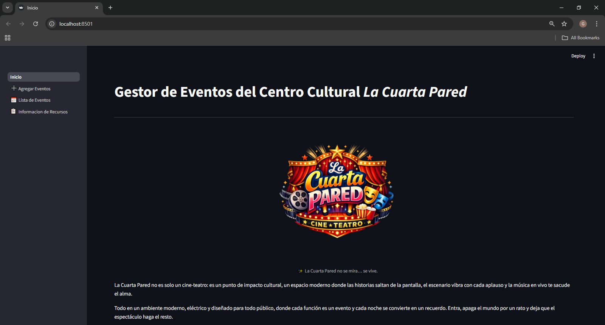
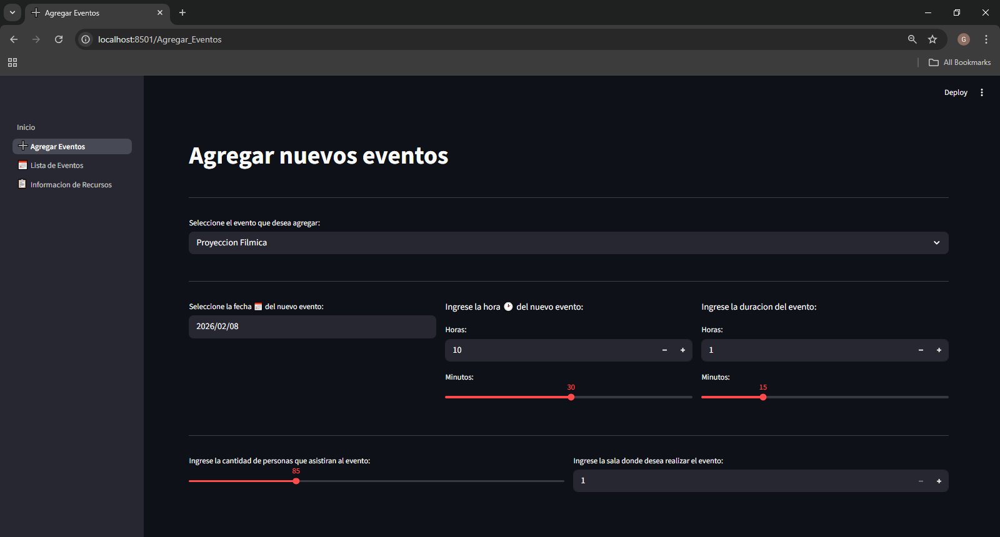
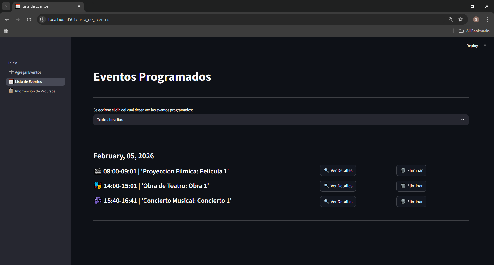
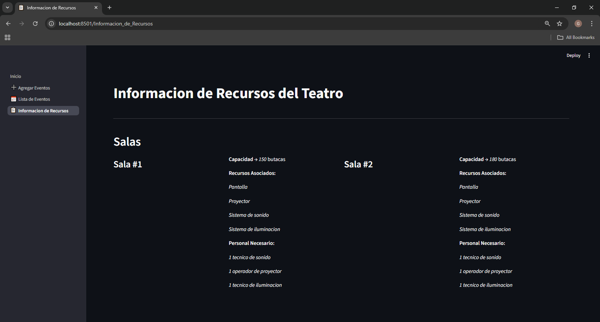

# Planificador Inteligente de Eventos

*Primer Proyecto de Programación, primer año de Ciencia de la Computación*

## Descripción

El proyecto consiste en construir una aplicación de software completa para planificar **eventos** que consumen **recursos** de un inventario limitado.

## Qué opciones ofrece la aplicación:

- **Agregar** un nuevo evento (en un rango de tiempo de 30 días), invocando toda la lógica de validación. Ante colisiones de recursos y/o eventos, presenta una funcionalidad de **búsqueda automática de horarios**, es decir, analiza el calendario y **sugeiere** un intervalo de tiempo donde se pueda realizar sin conflictos ni violaciones de restricciones.

- **Ver Lista** de todos los eventos planificados en un rango de 30 días o de un día específico.

- **Ver Detalles** de un evento específico.

- **Eliminar** un evento existente, liberando sus recursos para que queden disponibles.

- **Ver Lista y Detalles** de los recursos del dominio.

Todo el estado de la aplicación se **guarda y carga desde un único archivo**.

## Tecnologías y Herramientas Empleadas

- Lenguaje: Python.

- Framework: Streamlit.

- Persistencia de Datos: JSON.

*Nota*: Para conocer todos los requerimientos de la aplicación, debe consultar el documento **requirements.txt**.

## Explicación del dominio y restricciones

El dominio elegido es un **cine-teatro** (ficticio) llamado *"La Cuarta Pared"*.

### Eventos

- **Proyecciones Fílmicas**: se pueden efectuar en cualquier sala del recinto. Pueden coincidir en un período de tiempo con otras proyecciones fílmicas u obras teatrales.

- **Obras Teatrales**: se deben efectuar en una sala que contenga un escenario modular (4, 5 o 6). Pueden coincidir en un período de tiempo con otras obras teatrales o proyecciones fílmicas.

- **Conciertos Musicales**: se deben efectuar en una sala que contenga un escenario modular (4, 5 o 6). Nunca deben coincidir en un período de tiempo con cualquier otro evento.

### Recursos

- **Salas**: el recinto cuenta con 6 salas, previamente equipadas con equipos de sonido, iluminación, pantallas, proyectores, entre otros. Cada sala es tratada de forma independiente, con un "id" único.

- **Empleados**: existen 5 grupos de empleados: técnicos de sonido, técnicos de iluminación, operadores de proyector, personal de limpieza y personal de seguridad. Cada grupo es tratado por su cantidad de miembros. El personal de limpieza y de seguridad depende de la asistencia del público: para menos de 100 personas se necesita al menos 1 de cada uno; entre 100 y 200 se necesitan al menos 2 de cada uno; y para mas de 200 personas se necesitan al menos 3 de cada uno.

*Nota*: Las características y cantidades de trabajadores necesarios de cada sala, y las cantidades de trabajadores de cada grupo pueden ser consultadas en la aplicación o ser revisadas en el JSON.

### Planificar un Evento

Como norma general, para programar cualquier evento se necesita un horario en la jornada donde se garanticen los siguientes aspectos:

> Una sala desocupada, cuya capacidad sea mayor que la cantidad de público asistente, y tenga instalados los equipos necesarios para el evento.

> Suficiente cantidad de empleados, que cumpla la cuota necesaria según la asistencia de público y los requerimientos de la sala.

> No se violen las restricciones de los eventos que no pueden coincidir con otros en el período de tiempo.

## Cómo ejecutar la aplicación

1) Clonar el repositorio, con `git clone`.

2) Instalar las dependencias nombradas en **requirements.txt**.

3) En la consola, abrir la carpeta del proyecto y escribir:
```bash
streamlit run App\Inicio.py
```

## Imágenes de la aplicación en uso







